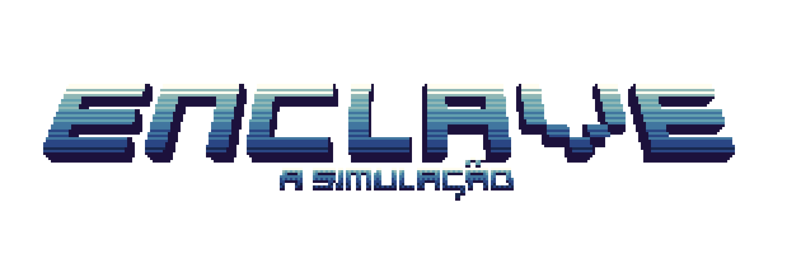

    

Este projeto faz parte do curso de Jogos Digitais da UFG (Universidade Federal de Goiás), ministrado pelo professor Sergio Teixeira de Carvalho.

## Trailer

## Sobre o Jogo

Enclave é um jogo de ação estilo Roguelite 2.5D com temática sci-fi, ambientado em uma fábrica de robôs abandonada. O jogo acompanha a jornada de um robô que participa de uma simulação, testando suas habilidades de sobrevivência e resolução de problemas para o Enclave.

Com elementos de exploração e combate dinâmico, o jogo oferece uma experiência envolvente e desafiadora para os jogadores.

## Engine Utilizada

O jogo está sendo desenvolvido utilizando a engine Godot. A Godot é uma engine de código aberto e gratuita, ideal para a criação de jogos 2D e 3D. Ela oferece uma variedade de ferramentas e recursos para o desenvolvimento de jogos de forma eficiente e flexível.

## Build

Você pode baixar a versão mais recente do jogo clicando no link abaixo:
[Enclave](Enclave.zip)

## Idealizadores

<table align="center">
    <tr>
      <td align="center">
        <a href="https://github.com/ronanvcjunior">
             
              <b>RONAN VIEIRA</b>
        </a>
        

          Game Designer 
          Artista 
          Programador
        

    </td>
    <td align="center">
        <a href="https://github.com/luciosjunq">
             
            <b>LÚCIO SÉRGIO</b>
        </a>
        

          Sound Designer   
        

    </td>
    <td align="center">
        <a href="https://github.com/lsdelima">
             
            <b>LUIS RICARDO</b>
        </a>
        

          Programador   
        

    </td>
    <td align="center">
        <a href="https://github.com/Gstaveira">
             
            <b>GABRIEL SILVA</b>
        </a>
        

          Programador   
        

    </td>
    <td align="center">
        <a href="https://github.com/AlexandreDemarchiBR">
             
            <b>MILTON ALEXANDRE</b>
        </a>
        

          Programador   
        

    </td>
    </tr>
</table>
